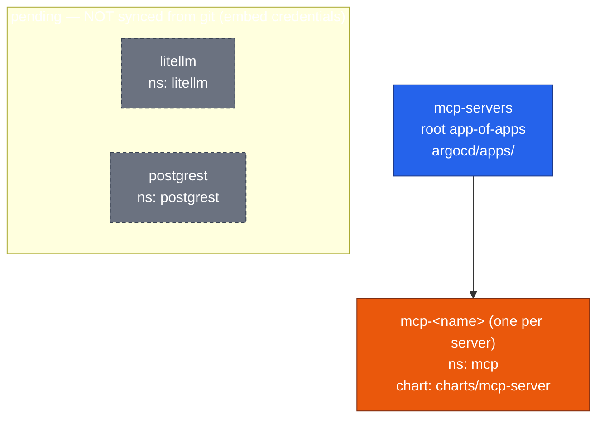

# Argo CD architecture

How this repo maps to Argo CD Applications in the cluster. There are two
independent app-of-apps trees — **platform** and **mcp-servers** — plus a small
set of unsynced **pending** apps.

> **Key idea:** every Argo CD `Application` object lives in the `argocd`
> namespace, regardless of which namespace it *deploys into*
> (`spec.destination.namespace`). A git folder like `argocd/cert-manager/` is
> just a directory of files, not a Kubernetes namespace. That's why the
> per-namespace **wrapper** apps are named `platform-<namespace>` — so they don't
> collide with the workload app of the same name.

## Platform tree

The `platform` root app-of-apps syncs `argocd/platform-apps/`, which defines the
four AppProjects and one `platform-<namespace>` app-of-apps per namespace. Each
of those syncs its `argocd/<namespace>/` directory, which holds the workload
Application(s) that deploy into that namespace.

```mermaid
flowchart TD
  classDef root fill:#2563eb,color:#fff,stroke:#1e3a8a
  classDef aoa fill:#16a34a,color:#fff,stroke:#14532d
  classDef wl fill:#ea580c,color:#fff,stroke:#7c2d12
  classDef proj fill:#7c3aed,color:#fff,stroke:#4c1d95

  ROOT["platform<br/>root app-of-apps<br/>argocd/platform-apps/"]:::root

  ROOT --> PROJ["AppProjects<br/>add-ons · ai · system · yugabyte"]:::proj

  ROOT --> A1["platform-cert-manager"]:::aoa --> W1["cert-manager<br/>ns: cert-manager"]:::wl
  ROOT --> A2["platform-gpu-operator"]:::aoa --> W2["gpu-operator<br/>ns: gpu-operator"]:::wl
  ROOT --> A3["platform-metallb-system"]:::aoa --> W3["metal<br/>ns: metallb-system"]:::wl
  ROOT --> A4["platform-longhorn-system"]:::aoa --> W4["longhorn<br/>ns: longhorn-system"]:::wl
  ROOT --> A5["platform-comfyui"]:::aoa --> W5["comfyui-gui<br/>ns: comfyui"]:::wl
  ROOT --> A6["platform-langflow"]:::aoa --> W6["langflow-ide<br/>ns: langflow"]:::wl
  ROOT --> A7["platform-open-webui"]:::aoa --> W7["open-webui<br/>ns: open-webui"]:::wl
  ROOT --> A8["platform-cattle-system"]:::aoa --> W8["rancher<br/>ns: cattle-system"]:::wl
  ROOT --> A9["platform-cattle-monitoring-system"]:::aoa
  A9 --> W9a["rancher-monitoring<br/>ns: cattle-monitoring-system"]:::wl
  A9 --> W9b["rancher-monitoring-crd<br/>ns: cattle-monitoring-system"]:::wl
  ROOT --> A10["platform-yugabytedb"]:::aoa
  A10 --> W10a["yugabyte<br/>ns: yugabytedb"]:::wl
  A10 --> W10b["pgadmin<br/>ns: yugabytedb"]:::wl
```

**Legend:** 🔵 root app-of-apps · 🟢 per-namespace app-of-apps (wrapper) ·
🟠 workload Application · 🟣 AppProjects.

| Wrapper (app-of-apps) | Namespace dir | Workload app(s) | AppProject | Chart source |
|---|---|---|---|---|
| `platform-cert-manager` | `cert-manager` | cert-manager | add-ons | `cert-manager` @ charts.jetstack.io |
| `platform-gpu-operator` | `gpu-operator` | gpu-operator | add-ons | `gpu-operator` @ helm.ngc.nvidia.com/nvidia |
| `platform-metallb-system` | `metallb-system` | metal | add-ons | `metallb` @ metallb.github.io/metallb |
| `platform-longhorn-system` | `longhorn-system` | longhorn | add-ons | `longhorn` @ charts.longhorn.io |
| `platform-comfyui` | `comfyui` | comfyui-gui | ai | `comfyui-gui/chart` @ github.com/lfoss0612/comfyui-helm-chart |
| `platform-langflow` | `langflow` | langflow-ide | ai | `langflow-ide` @ langflow-ai.github.io/langflow-helm-charts |
| `platform-open-webui` | `open-webui` | open-webui | ai | `open-webui` @ helm.openwebui.com |
| `platform-cattle-system` | `cattle-system` | rancher | system | `rancher` @ releases.rancher.com/server-charts/latest |
| `platform-cattle-monitoring-system` | `cattle-monitoring-system` | rancher-monitoring, rancher-monitoring-crd | system | `rancher-monitoring` @ charts.rancher.io; crd @ github.com/rancher/charts |
| `platform-yugabytedb` | `yugabytedb` | yugabyte, pgadmin | yugabyte | `yugabyte` @ charts.yugabyte.com; `pgadmin4` @ helm.runix.net |

Each wrapper and the root use `syncPolicy.automated` with `prune: false` and
`selfHeal: true` (strict GitOps: UI overrides are reverted). Workload apps keep
their own `syncPolicy` from the upstream export.

## mcp-servers tree & pending apps

`litellm` and `postgrest` live in `argocd/pending/` and are managed directly in
Argo CD (no wrapper points at them). Their specs embed credentials, so they are
deliberately excluded from GitOps until externalized.

## How a change flows

1. Edit a workload manifest in `argocd/<namespace>/<app>.yaml` (e.g. a Helm
   parameter) and push to `main`.
2. The owning `platform-<namespace>` app-of-apps detects the change and updates
   the workload Application object (`selfHeal: true`).
3. The workload Application re-syncs its chart with the new value and redeploys.

Because it is strict GitOps, edit parameters in git — not the Argo CD UI (UI
overrides get reverted to match git).
